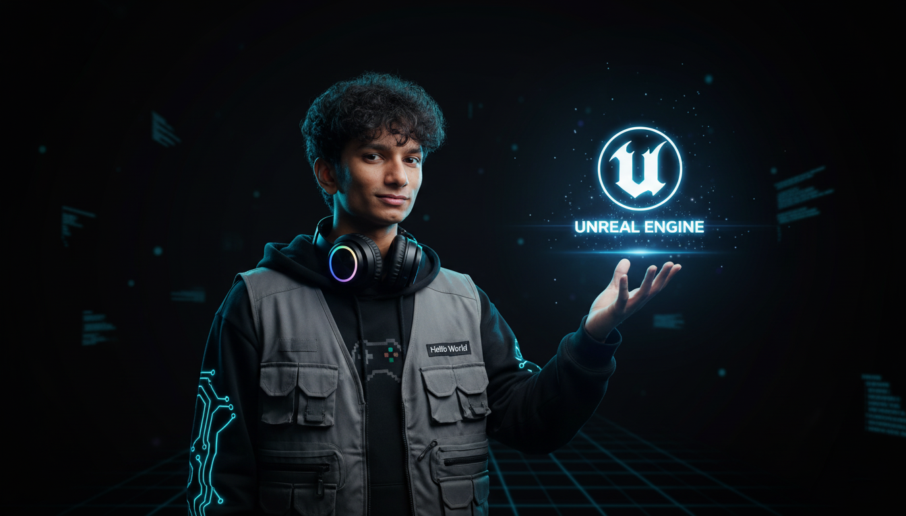

<!-- Banner -->
<h1 align="center">🎮 Lihindu Perera — Digital Experience Architect ⚡</h1>

<p align="center">
  
</p>

<p align="center">
  <em>Where imagination meets logic — and worlds are built with keystrokes 🚀</em>
</p>

---

### 🧠 About Me

> *"Innovation isn’t an option — it’s a responsibility."*

- 🕹 Building games powered by **AI, physics & storytelling**
- 📲 Developing **cross-platform ecosystems**
- 🎨 Designing UIs that people don’t just use — they **experience**
- ⚡ Turning bugs into features since **Day 1**

---

### 🌐 Portfolio Showcase

<p align="center">
  <a href="https://lihinduperera.github.io/Lihindu-portfolio/" target="_blank">
    
  </a>
</p>

<p align="center">
  <a href="https://lihinduperera.github.io/Lihindu-portfolio/" target="_blank">
    
  </a>
</p>

<p align="center">
  🚀 Explore my interactive developer portfolio built to showcase projects, creativity, and digital experiences.
</p>

<p align="center">
  ⚠️ <strong>Note:</strong> This portfolio is currently optimized for <strong>desktop devices</strong> and may not provide the best experience on mobile screens.
</p>

---

### 🛠 Tech Arsenal

#### 💻 Core Stack  
<p align="center">

</p>

#### 🧩 Engines & Frameworks  
<p align="center">

</p>

#### 🗄 Databases & Tools  
<p align="center">

</p>

---

### 🚀 GitHub Analytics — My Universe in Data

<div align="center">
  
  <!--  -->
</div>

<p align="center">
  
</p>

---

### 🧬 Code DNA — TL;DR Version of Me

```python
class LihinduPerera:
    def __init__(self):
        self.role = "Digital Experience Architect"
        self.specialties = [
          "Unreal Engine", 
          "Unity", 
          "Flutter", 
          "React Native"
        ]
    
    def say_hello(self):
        return "Let's build something extraordinary 🎮"
````

---

### 👁 Profile Views

<div align="center">
  
</div>

---

### 🌐 Connect With Me

<p align="center">
  <a href="mailto:lihindu.indudunu.perera@gmail.com">
    
  </a>

  <a href="https://www.linkedin.com/in/lihindu-perera-231024349/">
    
  </a>

  <a href="https://github.com/LihinduPerera">
    
  </a>

  <a href="https://www.facebook.com/sa.lihindu">
    
  </a>
</p>

<p align="center">
  <strong>✨ In the space between imagination and execution — innovation lives ✨</strong>
</p>
